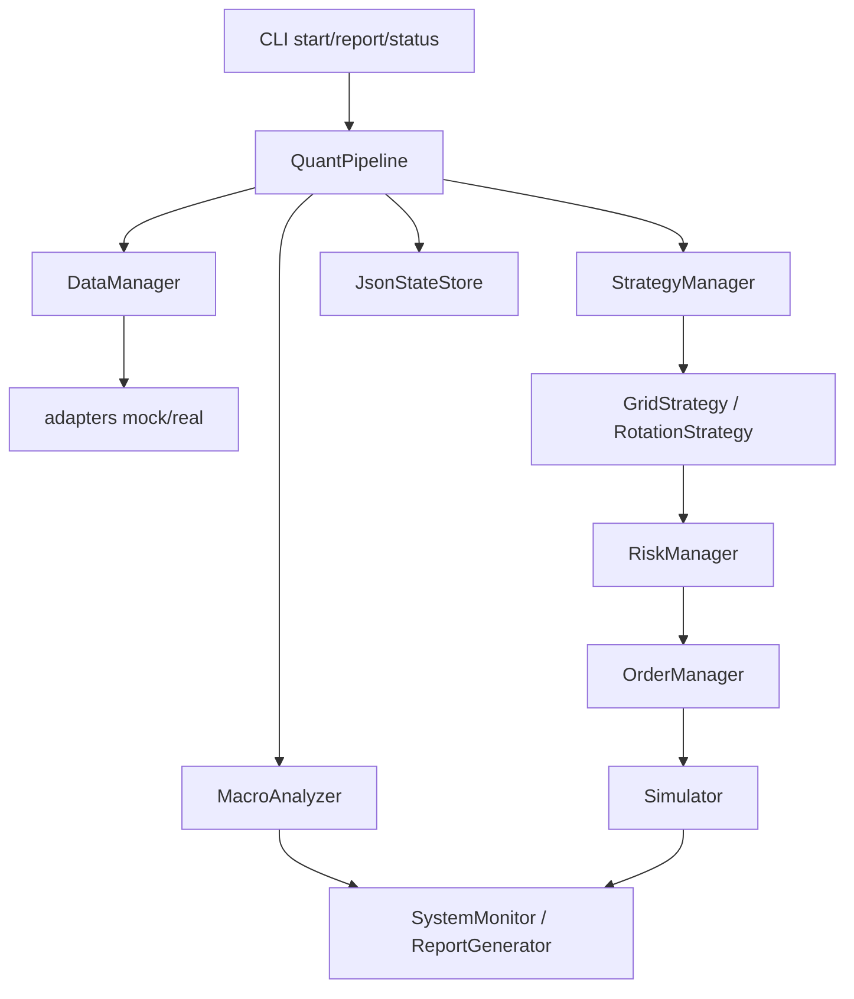
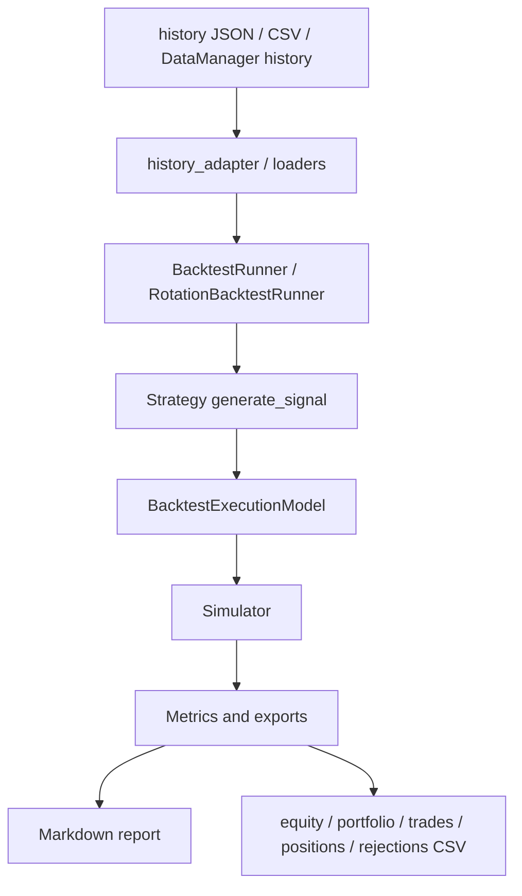

# 架构说明

`quant-pipeline` 当前是 ETF 量化助手的研究和模拟交易底座。核心目标是把数据适配、策略生成、风控检查、模拟执行、状态持久化、监控报告和回测组织成可测试、可迭代的流水线。

## 当前阶段边界

当前系统处于 mock/simulator 阶段：

- adapter 默认返回 mock 或空数据，用于验证程序链路。
- `mx_data.history` 的 `real` 模式可通过 `history_command` 接入外部命令式 provider；其他 `real` 能力尚未接入真实外部服务，会明确标记为不可用。
- `Simulator` 是简化成交模型，不等价于券商撮合。
- QMT/实盘执行、API 和 Web 界面尚未实现。
- 回测可用于验证策略逻辑和导出审计数据，但不包含交易所官方日历、部分成交和复杂组合回测；真实历史数据源目前只提供外部命令 provider 接入位。

## 模块职责

| 模块 | 职责 | 当前状态 |
|---|---|---|
| `adapters/` | 外部行情、选股、搜索和知识服务适配 | 已有 mock/real 模式；`mx_data.history` 支持外部命令 provider，其余 real 能力仍未接真实服务 |
| `data/` | 数据管理、缓存、字段契约和 adapter 错误包装 | 已覆盖基础字段、数值类型、非负单位和可选时效 |
| `analysis/` | 宏观分析、市场情绪和投资建议生成 | `MacroAnalyzer` 已接入主循环，当前仍基于 mock/规则输出 |
| `strategy/` | 网格策略、行业轮动策略和策略管理 | grid/rotation 基础路径可用 |
| `risk/` | ETF 质量、仓位、止损和组合风险检查 | 基础规则可用，真实 ETF 指标仍依赖后续数据接入 |
| `execution/` | 模拟执行器和内部订单管理 | `Simulator` 支持整手、手续费、均价、持仓和估值 |
| `backtest/` | 历史回测、成交模型、交易日历和历史数据转换 | grid/rotation 回测、CSV/JSON 输入、导出和审计能力已启动 |
| `persistence/` | JSON 状态保存、恢复和迁移 | v1 快照和旧版状态最小迁移已具备 |
| `monitor/` | 状态指标、报告和告警事件 | 本地报告和 JSONL 告警可用 |
| `config/` | 运行配置、策略配置和配置校验 | `config validate` 已覆盖关键字段、类型和范围 |
| `cli/` | 命令行入口 | 已支持启动、状态、报告、健康检查、告警、配置校验、回测和历史转换 |

## 运行主链路

`QuantPipeline` 是模拟运行入口。典型单轮执行如下：



关键边界：

- `DataManager` 负责清洗和校验 adapter 返回值，策略不直接信任外部数据。
- `MacroAnalyzer` 参与主循环，输出市场情绪和投资建议。
- 策略只产生信号，不直接修改账户。
- 风控决定订单是否允许继续执行。
- `OrderManager` 记录 pipeline 内部订单状态。
- `Simulator` 修改现金、持仓和成交记录。
- `JsonStateStore` 负责跨进程恢复，但不代表真实券商订单回报。

## 回测链路

回测路径复用策略和 `Simulator`，但由 `backtest/` 提供历史输入、成交前约束和结果导出。



`BacktestExecutionModel` 当前负责：

- 比例滑点。
- 成交量参与率限制。
- 同一根 bar 内成交量占用。
- 成交前拒单归因。

`Simulator` 当前仍负责：

- 整手买卖。
- 买卖双边佣金率和单笔最低佣金。
- 均价。
- 持仓和市值估算。
- 已实现盈亏。

`RotationStrategy` 从组合快照读取实际成本参数，按预计卖出净所得和买入佣金后的可支付金额计算整手数量，避免同一轮卖旧买新时因最低佣金产生超额买单。

这层拆分的目的，是为后续部分成交、限量成交和更复杂失败归因预留位置。

## 数据契约

### 实时行情

`DataManager.get_etf_realtime()` 期望字段：

```text
symbol,price,open,high,low,pre_close,volume,amount,timestamp
```

### 净值

`DataManager.get_etf_nav()` 期望字段：

```text
symbol,nav,price,premium,timestamp
```

### 历史行情

`DataManager.get_etf_history()` 期望字段：

```text
date,open,high,low,close,volume,amount
```

这些字段会被 `DataManager` 校验；回测的 grid CSV 使用同一组字段。

### rotation 历史输入

rotation 支持 JSON snapshot 数组：

```json
[
  {
    "date": "2026-01-01",
    "symbols": {
      "510300": {"close": 12.0, "prices": [10.0, 11.0, 12.0], "volume": 1000000}
    }
  }
]
```

rotation CSV 长表字段：

```text
date,symbol,close,prices,volume
```

其中 `prices` 使用 `|` 分隔。

## 状态持久化

`JsonStateStore` 保存：

- `Simulator` 账户、持仓、成交和手续费配置。
- `GridStrategy` ledger。
- `RotationStrategy` 调仓状态、已选 ETF、pending 计数和交易记录。
- `OrderManager` 内部订单状态。
- 运行 metadata，例如 `last_run_at` 和 `last_market_time_by_symbol`。

当前已有 v1 快照和旧版无顶层 `version` 状态的最小迁移。后续如果进入实盘，需要扩展真实订单状态、迁移审计和 SQLite 或其他更可靠存储。

## 监控和报告

当前报告链路覆盖：

- 组合总值、现金、持仓和盈亏。
- 系统健康指标。
- 数据源健康状态。
- 最近告警事件。

`AlertManager` 可以把结构化告警写入 JSONL。外部通知通道尚未接入。

## CLI 入口

主要命令：

```powershell
python cli\commands.py start --strategy grid
python cli\commands.py status
python cli\commands.py report --type daily
python cli\commands.py health --json --strict
python cli\commands.py diagnose --json --strict
python cli\commands.py alerts --json
python cli\commands.py config init
python cli\commands.py config show --config config.local.json
python cli\commands.py config validate --json
python cli\commands.py backtest --strategy grid
python cli\commands.py backtest --strategy rotation
python cli\commands.py history probe --config path\to\config.json --symbol 510300 --start-date 2026-01-01 --end-date 2026-01-02
python cli\commands.py history export-grid --input-json path\to\grid-history.json --output data\grid-history.csv
python cli\commands.py history export-rotation --input-json path\to\rotation-histories.json --lookback 3 --output data\rotation-history.csv
```

## 后续演进

建议顺序：

1. 文档和验收口径收口，形成研究/模拟交付版。
2. 接入真实 `mx_data.history`，用 `history export-grid/export-rotation` 生成真实回测输入。
3. 增加真实 adapter health 最小查询和 guarded e2e。
4. 扩展回测成交模型，支持部分成交和更细失败归因。
5. 扩展状态迁移和真实订单状态机。
6. 在数据、状态和 kill switch 都可靠后，再预研 QMT/实盘。
